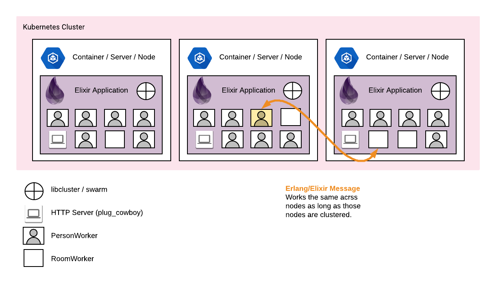

This tutorial demonstrates using
[Elixir][elixir]
processes ([OTP][otp])
in a 3 node cluster managed by
[Google Kubernetes Engine][gcp-kubernetes].
Elixir module [libcluster][libcluster] automatically joins new nodes the cluster when
[Kubernetes](kubernetes) starts Docker containers.
Elixir module [swarm][swarm] maintains a replicated process registry and
distributes OTP processes across the cluster, and migrates them as needed.

[elixir]: https://elixir-lang.org
[otp]: https://elixir-lang.org/getting-started/mix-otp/genserver.html
[kubernetes]: https://kubernetes.io
[gcp-kubernetes]: https://cloud.google.com/kubernetes-engine/
[libcluster]: https://github.com/bitwalker/libcluster
[swarm]: https://github.com/bitwalker/swarm

This setup will work with most Elixir OTP applications, and with Kubernetes running on any platform.

The example Elixir OTP application, [House Party][house-party-imdb],
will setup each **room** as a process and each **person** as a process.
People **wander** into rooms (unless the room is full) until they are ready to leave the party.
All state is maintained in OTP processes, no database is connected.
A very simple web interface is attached for convenience, but all interactions are via OTP/GenServer processes and messages.

[house-party-imdb]: https://www.imdb.com/title/tt0099800/

<!-- TODO REVIEWER
I plan on making a medium series with more details on this example project.
You can see more details here: https://github.com/zeroasterisk/HouseParty-elixir-libcluster-swarm-demo

This is a bit too complicated to put into this tutorial in detail,
but it does a fairly good job communicating the complexity of the setup and what you can accomplish.
I would be willing to replace with a simpler project for this tutorial, and keeping the HouseParty for a medium article...

Advice?
-->



A bit more clarification on what "cluster" means here.

*   An "Elixir/Erlang cluster" means the application is running on multiple nodes (servers).
    Each of the nodes are aware of and connected to each other, and will message each other directly.
    This is normal for Elixir/Erlang applications, but often difficult to setup with ephemeral containers &amp; IPs.
*   A "Kubernetes cluster" is a system of machines (or VMs) which is managed by
    the Kubernetes engine and will be used to run "pods" (container workloads).

If you have a Kubernetes cluster, without an Elixir cluster, you will have several
Elixir/Erlang nodes but they will not be aware of each other.  Elixir/Erlang excels
at managing processes and process messaging between nodes *(learn more about [OTP][what_is_otp])*.

[what_is_otp]: https://learnyousomeerlang.com/what-is-otp

There is a similar guide for
[Phoenix on Google Kubernetes Engine](https://cloud.google.com/community/tutorials/elixir-phoenix-on-kubernetes-google-container-engine)
if you do not want an Elixir cluster.


## Prerequisites

This tutorial will use the Google Cloud SDK to build and deploy the application for production.

1.  Create a project in the [Google Cloud Platform Console][console].
1.  Enable billing for your project.
1.  [Enable the Google Kubernetes Engine][enable_kubernetes].
1.  Install and initialize the [Google Cloud SDK][sdk].

    1.  After initializing the SDK, configure the gcloud CLI for your project_id.

        gcloud config set project <projectid>

[console]: https://console.cloud.google.com/
[enable_kubernetes]: https://console.cloud.google.com/kubernetes/
[sdk]: https://cloud.google.com/sdk/

This guide uses `house-party` as the project_id.


This tutorial will also require Docker and Elixir.

1.  Install **Docker 17.05 or later** if you do not already have it. Find
    instructions on the [Docker website][install_docker].

1.  Install the Kubernetes component of the Google Cloud SDK:

        gcloud components install kubectl

1.  Install **Elixir 1.4 or later** if you do not already have it. If you are
    on MacOS and have [Homebrew][homebrew], you can run:

        brew install elixir

    Otherwise consult the [Elixir install][install_elixir]
    guide for your operating system.

1.  Install the **hex**, and **rebar** archives.

        mix local.hex
        mix local.rebar

[install_docker]: https://www.docker.com/get-started
[install_elixir]: https://elixir-lang.org/install.html
[homebrew]: https://brew.sh

## Building the HouseParty Application

Here is our basic plan:

*   Create an Elixir application with OTP processes: `RoomWorker`, `PersonWorker`
*   Add the [libcluster][libcluster] package which will cluster our nodes using the Kubernetes API
*   Add the [swarm][swarm] package which will distribute our process across the cluster
*   Add the [plug_cowboy][plug_cowboy] package which provides a simple HTTP server
*   Add the [distillery][distillery] package for creating production releases
*   Use Docker to build your app release in a Docker image
*   Deploy your app on Google Kubernetes Engine
*   Scale and update your app using Kubernetes

[distillery]: https://github.com/bitwalker/distillery
[plug_cowboy]: https://github.com/elixir-plug/plug_cowboy

This tutorial assumes you are already familiar with Elixir development.
The tutorial will walk you through creating minimal versions of the files in question.

<!-- could link to more rhobust articles when ready -->

### Create a new app and add packages


1.  Create a new Elixir application with a supervisor.


    ```shell
    $ mix new house_party --sup
    $ cd house_party
    ```

1.  Edit `mix.exs` and add all of our runtime dependencies.

    *   [libcluster][libcluster] package which will cluster our nodes using the Kubernetes API
    *   [swarm][swarm] package which will distribute our process across the cluster
    *   [plug_cowboy][plug_cowboy] package which provides a simple HTTP server
    *   [distillery][distillery] package for creating production releases

    ```ex
    defp deps do
      [
        {:distillery, "~> 2.0"},
        {:libcluster, "~> 3.0"},
        {:plug_cowboy, "~> 2.0"},
        {:swarm, "~> 3.3"},
      ]
    end
    ```

1.  Continue editing `mix.exs` and add `eex` to the `extra_applications` started automatically.


    ```ex
    def application do
      [
        extra_applications: [:logger, :eex],
        mod: {HouseParty.Application, []}
      ]
    end
    ```

1.  Save `mix.exs`
1.  In a terminal run this to download the packages

    ```shell
    $ mix deps.get
    ```

### Create the RoomWorker, PersonWorker & HouseParty code

Briefly, OTP processes expose functionality through GenServer calls (sync), casts (async), and info messages.
We will not cover this in detail, but you can download the code below, or copy/paste the content manually.


`RoomWorker` is an OTP process which stores configuration for the room as well as a list of all the people in the room.

It has functionality for `add_person`, `rm_person` as well as `take` which exposes the current state.

```ex
# lib/house_party/room_worker.ex
defmodule HouseParty.RoomWorker do
  use GenServer
  alias HouseParty.RoomWorker
  @timeout :infinity

  defstruct [
    name: nil, # atom
    max: 10, # int, max people in room
    count: 0, # int, count of people currently in room
    people: %{}, # MapSet of list of people in rooms as [atom]
  ]

  # Helpul external API
  def start_link(name) when is_bitstring(name) or is_atom(name), do: start_link(%RoomWorker{name: name})
  def start_link(%RoomWorker{name: name} = state) when is_atom(name) do
    GenServer.start_link(__MODULE__, state, [timeout: @timeout])
  end
  def start_link(%{} = state), do: %RoomWorker{} |> Map.merge(state) |> start_link()
  def take(pid, fields), do: GenServer.call(pid, {:take, fields})
  def add_person([], _person), do: :ok
  def add_person([pid | rest], person) do
    case add_person(pid, person) do
      :ok -> add_person(rest, person)
      :full -> :full
      :error -> :error
    end
  end
  def add_person(pid, person), do: GenServer.call(pid, {:add_person, person})
  def rm_person([], _person), do: :ok
  def rm_person([pid | rest], person) do
    case rm_person(pid, person) do
      :ok -> rm_person(rest, person)
      :error -> :error
    end
  end
  def rm_person(pid, person), do: GenServer.call(pid, {:rm_person, person})

  # GenServer internal API
  def init(%RoomWorker{people: people} = state) do
    {:ok, state |> Map.put(:people, MapSet.new(people))}
  end
  def handle_call({:take, fields}, _from, state) do
    {:reply, {:ok, Map.take(state, fields)}, state}
  end
  def handle_call({:add_person, _new_people}, _from, %RoomWorker{count: count, max: max} = state) when count >= max do
    {:reply, :full, state}
  end
  def handle_call({:add_person, person_name}, _from, %RoomWorker{people: people, max: max} = state) when is_atom(person_name) do
    people = people |> MapSet.put(person_name)
    count = Enum.count(people)
    if count <= max do
      new_state = state
                  |> Map.put(:count, count)
                  |> Map.put(:people, people)
      {:reply, :ok, new_state}
    else
      {:reply, :full, state}
    end
  end
  def handle_call({:rm_person, person_name}, _from, %RoomWorker{people: people} = state) when is_atom(person_name) do
    people = people |> MapSet.delete(person_name)
    count = Enum.count(people)
    new_state = state
                |> Map.put(:count, count)
                |> Map.put(:people, people)
    {:reply, :ok, new_state}
  end

  # These are special swarm interfaces to control handoff and migration
  def handle_call({:swarm, :begin_handoff}, _from, state) do
    {:reply, {:resume, state}, state}
  end
  def handle_cast({:swarm, :end_handoff, state}, _init_state) do
    {:noreply, state}
  end
  def handle_cast({:swarm, :resolve_conflict, other_node_state}, state) do
    {:noreply, state}
  end
  def handle_info({:swarm, :die}, %RoomWorker{name: name, people: people} = state) do
    # should do cleanup...?  maybe swarm will auto-move?
    {:stop, :shutdown, state}
  end
end
```

`PersonWorker` is an OTP process which stores configuration for the person as well as a log of the rooms already entered.

It has functionality for `walk_into`, `wander` as well as `take` which exposes the current state.

There is also a `wanderlust` delayed process loop, which triggers random movements through rooms.

```ex
# lib/house_party/person_worker.ex
defmodule HouseParty.PersonWorker do
  use GenServer
  alias HouseParty.PersonWorker
  @timeout :infinity

  defstruct [
    name: nil, # atom
    current_room: nil, # nil = not yet entered, :left_party = gone, or a room name
    count: 0, # how many rooms person has entered
    max: 100, # how many rooms until person leaves
    wander_delay_ms: 1000, # when wandering, move rooms after this delay (in ms)
    log: [], # [{<time>, <room>}, ...]
  ]

  # Helpul external API
  def start_link(name) when is_atom(name), do: start_link(%PersonWorker{name: name})
  def start_link(%PersonWorker{name: name} = state) when is_atom(name) do
    GenServer.start_link(__MODULE__, state, [timeout: @timeout])
  end
  def stop(pid, reason \\ :normal), do: GenServer.stop(pid, reason)
  def take(pid, fields), do: GenServer.call(pid, {:take, fields})
  def walk_into(pid, room) when is_pid(pid) and is_atom(room), do: GenServer.call(pid, {:walk_into, room})
  def wanderlust(pid), do: GenServer.call(pid, {:wanderlust})

  # GenServer internal API
  def init(%PersonWorker{} = state) do
    {:ok, state}
  end
  def handle_call({:take, fields}, _from, state) do
    {:reply, {:ok, Map.take(state, fields)}, state}
  end
  def handle_call({:walk_into, new_room}, _from, %PersonWorker{} = state) when is_atom(:new_room) do
    movement = lookup_pids_for_move(state, new_room)
    new_state = HouseParty.PersonMovement.walk_into(state, movement)
    {:reply, :ok, new_state}
  end
  def handle_call({:wanderlust}, _from, %PersonWorker{} = state) do
    wanderlust_schedule_next(state)
    {:reply, :ok, state}
  end

  # These are special swarm interfaces to control handoff and migration
  def handle_call({:swarm, :begin_handoff}, _from, state) do
    {:reply, {:resume, state}, state}
  end
  def handle_cast({:swarm, :end_handoff, state}, _init_state) do
    {:noreply, state}
  end
  def handle_cast({:swarm, :resolve_conflict, other_node_state}, state) do
    {:noreply, state}
  end
  def handle_info({:swarm, :die}, %PersonWorker{name: name} = state) do
    {:stop, :shutdown, state}
  end


  # start wandering between rooms
  def handle_info({:wander}, %PersonWorker{} = state) do
    new_state = wander(state)
    wanderlust_schedule_next(new_state)
    {:noreply, new_state}
  end


  # Private Internal Functions, for wander/wanderlust (exposed via GenServer)
  def wanderlust_schedule_next(%PersonWorker{current_room: :left_party} = person) do
    :ok
  end
  def wanderlust_schedule_next(%PersonWorker{current_room: nil, wander_delay_ms: wander_delay_ms} = _person) do
    # 10x the normal delay, with up to 1x random added
    add = :rand.uniform(wander_delay_ms)
    delay = ((wander_delay_ms * 10) + add)
    Process.send_after(self(), {:wander}, delay)
  end
  def wanderlust_schedule_next(%PersonWorker{wander_delay_ms: wander_delay_ms} = _person) do
    # +/- up to 10% randomized
    subtract = :rand.uniform(Kernel.trunc(wander_delay_ms / 20))
    add = :rand.uniform(Kernel.trunc(wander_delay_ms / 10))
    delay = ((wander_delay_ms - subtract) + add)
    Process.send_after(self(), {:wander}, delay)
  end
  def wander(%PersonWorker{} = person) do
    room_names = HouseParty.get_all_rooms()
    wander(person, room_names)
  end
  def wander(%PersonWorker{} = person, room_names) when is_list(room_names) do
    new_room = wander_pick_new_room(person, room_names)
    movement = lookup_pids_for_move(person, new_room)
    HouseParty.PersonMovement.walk_into(person, movement)
  end
  def wander_pick_new_room(%PersonWorker{count: count, max: max} = _person, _room_names) when count >= max do
    :leave
  end
  def wander_pick_new_room(%PersonWorker{current_room: :left_party} = _person, _room_names) do
    :left_party
  end
  def wander_pick_new_room(%PersonWorker{current_room: nil} = _person, room_names) do
    room_names |> Enum.random()
  end
  def wander_pick_new_room(%PersonWorker{current_room: current_room} = _person, room_names) do
    room_names = room_names |> Enum.reject(fn(room) -> room == current_room end)
    if Enum.empty?(room_names) do
      nil
    else
      room_names |> Enum.random()
    end
  end
end
```

`PersonMovement` is a set of helper functions to handle the business logic of entering a new room and departing the old/current room.

```ex
# lib/house_party/person_movement.ex
defmodule HouseParty.PersonMovement do
  alias HouseParty.PersonWorker
  def lookup_pids_for_move(%PersonWorker{current_room: current_room}, new_room) when is_atom(new_room) do
    %{
      new_room: new_room,
      new_room_pid: HouseParty.get_room_pid(new_room),
      current_room: current_room,
      current_room_pid: HouseParty.get_room_pid(current_room),
    }
  end
  def walk_into(%PersonWorker{} = person, movement) do
    case enter_new_room(person, movement) do
      :ok ->
        case depart_current_room(person, movement) do
          :ok ->
            update_person_on_success(person, movement)
          :cannot_leave_nil ->
            update_person_on_success(person, movement)
          :error ->
            person
        end
      :full ->
        update_person_on_failed_too_full(person, movement)
      :error ->
        person
    end
  end
  defp enter_new_room(%PersonWorker{name: person_name}, %{new_room_pid: nil, new_room: :leave}) do
    :ok
  end
  defp enter_new_room(%PersonWorker{name: person_name}, %{new_room_pid: nil} = movement) do
    :error
  end
  defp enter_new_room(%PersonWorker{name: person_name}, %{new_room_pid: new_room_pid}) when is_pid(new_room_pid) do
    HouseParty.RoomWorker.add_person(new_room_pid, person_name)
  end
  defp depart_current_room(%PersonWorker{current_room: nil}, _movement) do
    :ok
  end
  defp depart_current_room(%PersonWorker{name: person_name}, %{current_room_pid: nil} = movement) do
    :error
  end
  defp depart_current_room(%PersonWorker{name: person_name}, %{current_room_pid: current_room_pid}) when is_pid(current_room_pid) do
    HouseParty.RoomWorker.rm_person(current_room_pid, person_name)
  end
  def update_person_on_success(%PersonWorker{log: log, count: count} = person, %{new_room: :leave}) do
    person |> Map.merge(%{
      current_room: :left_party,
      log: [{DateTime.utc_now, :leave, :leave} | log],
    })
  end
  def update_person_on_success(%PersonWorker{log: log, count: count} = person, %{new_room: new_room}) do
    person |> Map.merge(%{
      current_room: new_room,
      count: count + 1,
      log: [{DateTime.utc_now, new_room, :entered} | log],
    })
  end
  def update_person_on_failed_too_full(%PersonWorker{log: log, count: count} = person, %{new_room: new_room}) do
    person |> Map.merge(%{
      count: count + 1,
      log: [{DateTime.utc_now, new_room, :was_full} | log],
    })
  end
end
```

`HouseParty` is the public API to easily start Room and Person Workers, and interact with them.
It is also the only place where we use Swarm to control processes (processes themselves do not know they are managed across nodes).

*   `Swarm.register_name` is a way to start and register a Worker so Swarm Registry can track it and migrate the process across nodes.
*   `Swarm.registered` shows the names and PIDs for all of the Swarm managed processes (replicated across nodes).
*   `Swarm.join` & `Swarm.members` are tools to create groups of processes, for easy bulk management
*   `Swarm.publish` & `Swarm.multi_call` are tools to send messages to groups of processes

```ex
# lib/house_party.ex
defmodule HouseParty do
  require Logger
  alias HouseParty.PersonWorker
  alias HouseParty.RoomWorker

  # easy setup for party configurations
  def setup_party(:small) do
    template_person = %PersonWorker{max: 20, wander_delay_ms: 100}
    template_room = %RoomWorker{max: 10}
    build_party_from_templates(template_room, 5, template_person, 100)
    Swarm.multi_call(:house_party_people, {:wanderlust})
  end
  def setup_party(:big) do
    template_person = %PersonWorker{max: 10, wander_delay_ms: 100}
    template_room = %RoomWorker{max: 25}
    build_party_from_templates(template_room, 50, template_person, 2_000)
    Swarm.multi_call(:house_party_people, {:wanderlust})
  end
  def build_party_from_templates(template_room, n_rooms, template_person, n_people) when is_integer(n_rooms) and is_integer(n_people) do
    reset()
    Range.new(1, n_rooms)
    |> Enum.map(fn(i) -> String.to_atom("room_#{i}") end)
    |> Enum.map(fn(name) -> Map.merge(template_room, %{name: name}) end)
    |> add_rooms()
    Range.new(1, n_people)
    |> Enum.map(fn(i) -> String.to_atom("person_#{i}") end)
    |> Enum.map(fn(name) -> Map.merge(template_person, %{name: name}) end)
    |> add_people()
    :ok
  end

  def add_rooms([]), do: :ok
  def add_rooms(rooms) when is_list(rooms), do: add_rooms(:ok, rooms)
  def add_rooms(room) when is_atom(room), do: add_rooms(:ok, [room])
  def add_rooms(:ok, []), do: :ok
  def add_rooms(:ok, [room | rest]) do
    {status, _} = room |> add_room()
    status |> add_rooms(rest)
  end
  def add_rooms(:error, _list), do: :error

  defp add_room(%RoomWorker{name: room_name} = room) when is_atom(room_name) do
    name = build_process_name(:room, room_name)
    name |> Swarm.register_name(RoomWorker, :start_link, [room]) |> add_room_finish()
  end
  defp add_room(room) when is_atom(room) do
    name = build_process_name(:room, room)
    name |> Swarm.register_name(RoomWorker, :start_link, [room]) |> add_room_finish()
  end
  # handle the output from Swarm.register_name and auto-join the group if possible
  defp add_room_finish({:ok, pid}) do
    {Swarm.join(:house_party_rooms, pid), pid}
  end
  defp add_room_finish({:error, {:already_registered, pid}}), do: {:ok, pid}
  defp add_room_finish(:error), do: add_room_finish({:error, "unknown reason"})
  defp add_room_finish({:error, reason}) do
    {:error, reason}
  end

  def add_people([]), do: :ok
  def add_people(people) when is_list(people), do: add_people(:ok, people)
  def add_people(person) when is_atom(person), do: add_people(:ok, [person])
  # process all people in a loop, until empty or error
  def add_people(:ok, []), do: :ok
  def add_people(:ok, [person | rest]) do
    {status, _} = person |> add_person()
    status |> add_people(rest)
  end
  def add_people(:error, _list), do: :error

  defp add_person(%PersonWorker{name: person_name} = person) when is_atom(person_name) do
    name = build_process_name(:person, person_name)
    name |> Swarm.register_name(PersonWorker, :start_link, [person]) |> add_person_finish()
  end
  defp add_person(person) when is_atom(person) do
    name = build_process_name(:person, person)
    name |> Swarm.register_name(PersonWorker, :start_link, [person]) |> add_person_finish()
  end
  # handle the output from Swarm.register_name and auto-join the group if possible
  defp add_person_finish({:ok, pid}) do
    {Swarm.join(:house_party_people, pid), pid}
  end
  defp add_person_finish({:error, {:already_registered, pid}}), do: {:ok, pid}
  defp add_person_finish(:error), do: add_person_finish({:error, "unknown reason"})
  defp add_person_finish({:error, reason}) do
    Logger.error("add_people() failure for #{reason}")
    {:error, reason}
  end

  def get_person_pid(nil), do: nil
  def get_person_pid(person_name) when is_atom(person_name) do
    typed_name = build_process_name(:person, person_name)
    house_party_pids = Swarm.members(:house_party_people)
    Swarm.registered()
    |> Enum.filter(fn({_name, pid}) -> Enum.member?(house_party_pids, pid) end)
    |> Enum.filter(fn({name, _pid}) -> name == typed_name end)
    |> Enum.map(fn({_name, pid}) -> pid end)
    |> List.first()
  end
  def get_room_pid(nil), do: nil
  def get_room_pid(room_name) when is_atom(room_name) do
    typed_name = build_process_name(:room, room_name)
    house_party_pids = Swarm.members(:house_party_rooms)
    Swarm.registered()
    |> Enum.filter(fn({_name, pid}) -> Enum.member?(house_party_pids, pid) end)
    |> Enum.filter(fn({name, _pid}) -> name == typed_name end)
    |> Enum.map(fn({_name, pid}) -> pid end)
    |> List.first()
  end
  def get_all_rooms() do
    house_party_pids = Swarm.members(:house_party_rooms)
    Swarm.registered()
    |> Enum.filter(fn({_name, pid}) -> Enum.member?(house_party_pids, pid) end)
    |> Enum.map(fn({name, _pid}) -> name |> Atom.to_string() |> String.slice(5, 99) |> String.to_atom end)
    |> Enum.sort()
  end
  def get_all_people() do
    house_party_pids = Swarm.members(:house_party_people)
    Swarm.registered()
    |> Enum.filter(fn({_name, pid}) -> Enum.member?(house_party_pids, pid) end)
    |> Enum.map(fn({name, _pid}) -> name |> Atom.to_string() |> String.slice(7, 99) |> String.to_atom end)
    |> Enum.sort()
  end

  def build_process_name(type, name) do
    Atom.to_string(type) <> "_" <> Atom.to_string(name) |> String.to_atom()
  end
  def reset() do
    :house_party_rooms |> Swarm.publish({:swarm, :die})
    :house_party_people |> Swarm.publish({:swarm, :die})
  end

end
```

### Create a Stats module to report stats

We have a lot of processes and they may be in a variety of states.
This will show some summary stats for them.

```ex
# lib/house_party/stats.ex
defmodule HouseParty.Stats do
  alias HouseParty.PersonWorker
  alias HouseParty.RoomWorker
  def tldr() do
    tldr_gather() |> tldr_simplify()
  end
  def tldr_simplify(%{} = stats) do
    stats
    |> Map.merge(%{
      avg_wanderlust_completion: Float.round(Map.get(stats, :person_count, 0) / Map.get(stats, :person_max, 1) * 100, 1),
      avg_fullness: Float.round(Map.get(stats, :room_count, 0) / Map.get(stats, :room_max, 1) * 100, 1),
    })
    |> Map.drop([:person_count, :person_max, :room_count, :room_max])
  end
  def tldr_gather() do
    people_pids = Swarm.members(:house_party_people)
    room_pids = Swarm.members(:house_party_rooms)
    Swarm.registered()
    |> Enum.reduce(%{}, fn({name, pid}, acc) ->
      tldr_reducer({name, pid}, acc, people_pids, room_pids)
    end)
    |> Map.put(:total_people, Enum.count(people_pids))
    |> Map.put(:total_rooms, Enum.count(room_pids))
  end
  def tldr_reducer({name, pid}, %{} = acc, people_pids, room_pids) do
    cond do
      Enum.member?(people_pids, pid) ->
        {:ok, state} = PersonWorker.take(pid, [:count, :max, :current_room])
        key = tldr_reducer_key(pid, state)
        acc
        |> Map.put(key, Map.get(acc, key, 0) + 1)
        |> Map.merge(%{
          person_max: Map.get(acc, :person_max, 0) + state.max,
          person_count: Map.get(acc, :person_count, 0) + state.count,
        })
      Enum.member?(room_pids, pid) ->
        {:ok, state} = RoomWorker.take(pid, [:count, :max])
        acc
        |> Map.merge(%{
          room_max: Map.get(acc, :room_max, 0) + state.max,
          room_count: Map.get(acc, :room_count, 0) + state.count,
        })
      true -> acc
    end
  end
  def tldr_reducer_key(pid, %{current_room: nil}) do
    :people_waiting_to_enter_party
  end
  def tldr_reducer_key(pid, %{current_room: :left_party}) do
    :people_left_party
  end
  def tldr_reducer_key(pid, %{current_room: _current_room}) do
    :people_in_rooms
  end
end
```

### Create a Router module to expose via a web api

For convenience, we will expose functionality via a HTTP API, routing paths to HouseParty functions.

```ex
# lib/house_party/router.ex
defmodule HouseParty.Router do
  use Plug.Router
  use Plug.Debugger
  require Logger
  plug(Plug.Logger, log: :debug)
  plug(:match)
  plug(:dispatch)
  get "/hello" do
      send_resp(conn, 200, "world")
  end
  get "/scenario/small" do
    HouseParty.setup_party(:small)
    send_resp(conn, 200, tldr_body())
  end
  get "/scenario/big" do
    HouseParty.setup_party(:big)
    send_resp(conn, 200, tldr_body())
  end
  get "/stats/tldr" do
    send_resp(conn, 200, tldr_body())
  end
  # "Default" route that will get called when no other route is matched
  match _ do
    send_resp(conn, 404, "not found")
  end
  defp tldr_body() do
    """
    self: #{inspect(:erlang.node())}\nnodes: #{inspect(:erlang.nodes())}

    #{inspect(HouseParty.Stats.tldr())}
    """
  end
end
```

Whew.  That was a *lot* of code for a tutorial, but it provides us with a lot of functionality.

### Setup the application.ex to start processes

We want to auto start and supervise two processes:

*   The `plug_cowboy` web server.
*   The `libcluster` module to auto-connect to all of the nodes in Kubernetes.

```ex
# lib/house_party/application.ex
defmodule HouseParty.Application do
  @moduledoc false
  require Logger
  use Application

  def start(_type, _args) do
    port = get_port(Application.get_env(:house_party, :port))
    Logger.info(fn() -> "HTTP interface starting with port #{port}" end)
    libcluster_topologies = [
      hpgcpcluster: [
        strategy: Cluster.Strategy.Kubernetes,
        config: [
          mode: :ip,
          # these must match the Kubernetes Deployment values
          kubernetes_node_basename: "housepartyapp",
          kubernetes_selector: "app=housepartyapp",
          # how fast are we checking for changes?
          polling_interval: 10_000,
        ]
      ]
    ]
    children = [
      Plug.Cowboy.child_spec(scheme: :http, plug: HouseParty.Router, options: [port: port]),
      {Cluster.Supervisor, [libcluster_topologies, [name: HouseParty.ClusterSupervisor]]},
    ]

    opts = [strategy: :one_for_one, name: HouseParty.Supervisor]
    Supervisor.start_link(children, opts)
  end

  # get the port from configuration, as INT or STRING - defaults 4001
  defp get_port("${PORT}"), do: "PORT" |> System.get_env() |> get_port()
  defp get_port(port) when is_integer(port), do: port
  defp get_port(port) when is_bitstring(port), do: port |> Integer.parse() |> get_port()
  defp get_port({port, _}), do: port
  defp get_port(_), do: 4001 # default port, easier defaulting/development
end
```

### Configure the app

Our last file will be the `config.exs` file, and we only need a few entries here.

You must setup the port, so ENV variables can change the port number.

You can also turn on/off debug logging for swarm and libcluster.

```ex
# config/config.exs
use Mix.Config
config :house_party,
  port: "${PORT}"
config :logger,
  level: :info
config :swarm,
  distribution_strategy: Swarm.Distribution.Ring,
  debug: false
config :libcluster,
  debug: true
```

### Trust but verify... (optional)

Now you can start Elixir locally to test your application
(not clustered, no kubernetes api, expect warnings).

1.  Run the application from iex

```shell
$ iex -S mix
```

1.  Verify it is working in another terminal with curl:

```shell
$ curl 'http://localhost:4001/hello'
world%
$ curl 'http://localhost:4001/nope'
not found%
$ curl 'http://localhost:4001/stats/tldr'
self: :nonode@nohost
nodes: []

%{avg_fullness: 0.0, avg_wanderlust_completion: 0.0, total_people: 0, total_rooms: 0}

$ curl 'http://localhost:4001/scenario/small'
self: :nonode@nohost
nodes: []

%{avg_fullness: 0.0, avg_wanderlust_completion: 0.0, people_waiting_to_enter_party: 100, total_people: 100, total_rooms: 5}


$ curl 'http://localhost:4001/stats/tldr'
self: :nonode@nohost
nodes: []

%{avg_fullness: 94.0, avg_wanderlust_completion: 79.3, people_in_rooms: 47, people_left_party: 50, people_waiting_to_enter_party: 3, total_people: 100, total_rooms: 5}

$ curl 'http://localhost:4001/stats/tldr'
self: :nonode@nohost
nodes: []

%{avg_fullness: 0.0, avg_wanderlust_completion: 100.0, people_left_party: 100, total_people: 100, total_rooms: 5}
```

Use `CTRL+C` twice, to stop `iex`.

That's pretty cool.

On your local machine, you just ran a scenario with 100 PersonWorker processes, wandering through 5 RoomWorker processes.
You can also try the big scenario has 2000 people wandering through 50 rooms.

Next you will build into a Docker image and deploy to a Google Kubernetes Engine, then you can see this same scenario play out on a multi-node cluster.

## Enable releases with Distillery

Releases are the preferred way to package Elixir (and Erlang) applications for
deployment. You will configure the [Distillery][distillery] tool to create releases
for your app.

**Note:** If you already have Distillery set up for your application, you can
skip this section. But make sure `include_erts: true` is set in your `:prod`
release configuration. This tutorial assumes ERTS is included in releases.

### Set up Distillery

We already added the `distillery` dependency to the application.

Create a default release configuration by running:

```shell
$ mix release.init
```

That's it.  You can change release settings if you want, in the `rel` directory.

### Trust but verify... (optional)

Now you can create a new release and test out your configuration
(not clustered, no kubernetes api, expect warnings).

1.  Build the release:

    ```shell
    $ MIX_ENV=prod mix release --env=prod
    ```

1.  Run the application from the release on PORT 8080 using:

    ```shell
    $ REPLACE_OS_VARS=true PORT=8080 _build/prod/rel/house_party/bin/house_party foreground
    ```

1.  Verify it is working in another terminal with curl:

    ```shell
    $ curl 'http://localhost:8080/hello'
    world%
    $ curl 'http://localhost:8080/nope'
    not found%
    $ curl 'http://localhost:4001/hello'
    curl: (7) Failed to connect to localhost port 4001: Connection refused
    ```

## Wrap the application with Docker

The next step is to produce a Docker image that builds and runs your
application in a Docker container. You will define this image using a
Dockerfile.

### Create a Dockerfile

Various considerations go into designing a good Docker image. The Dockerfile
used by this tutorial builds a release and runs it with Alpine Linux.
If you are experienced with Docker, you can customize your image.

1.  Create a file called `Dockerfile` in your `house_party` directory. Copy the
    following content into it. Alternately, you can
    [download](https://github.com/GoogleCloudPlatform/community/blob/master/tutorials/elixir-phoenix-on-kubernetes-google-container-engine/Dockerfile)
    a sample annotated Dockerfile to study and customize.

```dockerfile
FROM elixir:alpine
ARG APP_NAME=house_party
ARG APP_SUBDIR=.
ENV MIX_ENV=prod \
    REPLACE_OS_VARS=true \
    TERM=xterm
WORKDIR /opt/app
COPY . .
RUN mix do deps.get, deps.compile, compile
RUN mix release --env=prod --verbose \
    && mv _build/prod/rel/${APP_NAME} /opt/release \
    && mv /opt/release/bin/${APP_NAME} /opt/release/bin/start_server
FROM alpine:latest
RUN apk update \
    && apk --no-cache --update add bash openssl-dev
ENV PORT=8080 \
    MIX_ENV=prod \
    REPLACE_OS_VARS=true
WORKDIR /opt/app
COPY --from=0 /opt/release .
EXPOSE ${PORT}
CMD ["/opt/app/bin/start_server", "foreground"]
```

1.  Create a file called `.dockerignore` in your `house_party` directory. Copy the
    following content into it. Alternately, you can
    [download](https://github.com/GoogleCloudPlatform/community/blob/master/tutorials/elixir-phoenix-on-kubernetes-google-container-engine/.dockerignore)
    a sample annotated file to study and customize.

```
_build
deps
test
assets/node_modules
```

### Test the Dockerfile

Build the image locally and test running your application from the image:

```shell
docker build --no-cache -t house_party .
```

The period at the end of the `docker build` command is required.
It denotes the root directory of the application you are building.

This will create a new Docker image on your local machine.

### Trust but verify... (optional)

You can now run the image in a Docker container on your local machine.

```shell
docker run -it -p 8080:8080 -e PORT:8080 house_party
```

In another terminal you can verify it is working with curl: (or open in your browser)

```shell
$ curl 'http://localhost:8080/hello'
world%
$ curl 'http://localhost:8080/nope'
not found%
```

NOTE: `^C` may not work to kill the server.  If not, use `^pq` to detach the terminal and kill the container with `docker kill $(docker ps -lq)`.

## Deploying your application to Google Kubernetes Engine

Now you're ready to deploy your application to Google Kubernetes Engine!

### Define your settings

The Google Cloud `PROJECT_ID` is the one you setup earlier.

You also need to define settings for the cluster, this guide names the cluster `hpgcpcluster`, assigns it 2 nodes, and the central zone.
Use these settings or define your own.  [Pick a zone near you][gcp_zone].

[gcp_zone]: https://cloud.google.com/compute/docs/regions-zones/

Additionally, you will define:
*   `REPO_NAME` which is used in the docker image
*   `ERLANG_COOKIE` which is used to secure Erlang node communication within your Kubernetes cluster
*   `DEPLOYMENT_NAME` which is used to select Kubernetes containers (must match libcluster topologies config, alphanumeric only)

Export these values to shell variables for easy use in future commands.

```shell
export PROJECT_ID=your_project_id
export GCP_CLUSTER=hpgcpcluster
export GCP_CLUSTER_NODE_COUNT=2
export GCP_CLUSTER_ZONE=us-central1-a
export REPO_NAME=house_party
export ERLANG_COOKIE=YOUWANTSOMETHINGREALLYSECRETHERE
export DEPLOYMENT_NAME=housepartyapp
```

NOTE: don't store the `ERLANG_COOKIE` in code for real world usage!

### Build the production image

To deploy the app, you will use the [Google Cloud Container Build][gcp_container_build]
service to build your Docker image in the cloud and store it in your project in the
[Google Cloud Container Registry][gcp_container_registry].

Execute the following command to run the build:

```shell
$ gcloud builds submit --tag=gcr.io/${PROJECT_ID}/${REPO_NAME}:v1 .
```

Replace `${PROJECT_ID}` with the ID of your Google Cloud Platform project.

After the build finishes, the image `gcr.io/${PROJECT_ID}/${REPO_NAME}:v1` will be
available. You can list the images you have built in your project using:

```shell
gcloud container images list
```

You can push and pull the image directly from your local registry.
See the [Container Registry how-to guides][gcp_registry_howto] for more details.

[gcp_container_build]: https://cloud.google.com/container-builder/
[gcp_container_registry]: https://cloud.google.com/container-registry/
[gcp_registry_howto]: https://cloud.google.com/container-registry/docs/pushing-and-pulling


### Create a Kubernetes cluster

Google Cloud Kubernetes Engine lets you create Kubernetes clusters (VMs in the cloud) to run workloads.
In this case, the workload is the HouseParty application, bundled into a Docker Image.
Kubernetes is in charge of running a number of copies (containers) of your Image and keeping them running.
Kubernetes will also do a blue/green migration to new versions when you tell it to.

Create the cluster with our defined settings

> Note that once the cluster is running, **you will be charged for the VM usage**.

```shell
$ gcloud container clusters create ${GCP_CLUSTER} --num-nodes=${GCP_CLUSTER_NODE_COUNT} --zone=${GCP_CLUSTER_ZONE}
```

This command creates a cluster of two machines. You can choose a different
size, but two is a good starting point.

It might take several minutes for the cluster to be created. You can check
the cloud console at http://cloud.google.com/console, under the Kubernetes
Engine section, to see that your cluster is running. You will also be able
to see the individual running VMs under the Compute Engine section.

You should now see your cluster in the list of running clusters for your project:

```shell
$ gcloud container clusters list
```

Configure the gcloud command-line tool to use your cluster by default,
so you don't have to specify it every time for the remaining gcloud commands.

```shell
$ gcloud config set container/cluster ${GCP_CLUSTER}
```

### Create a Kubernetes Secret to store the ERLANG_COOKIE

The `ERLANG_COOKIE` is a secret, and luckily Kubernetes has a really convenient way to store and share secrets:

```shell
$ kubectl create secret generic app-config --from-literal=erlang-cookie=${ERLANG_COOKIE}
```

Our deployment will use this secret to configure the Erlang cookie (so nodes can communicate).

### Create a Kubernetes configmap to store the vm.args

The Erlang VM is configured by VM args which will be replaced by Environment Variables at runtime.

1.   Create a file `vm.args`

    ```
    # vm.args
    ## Name of the node
    -name ${MY_BASENAME}@${MY_POD_IP}
    ## Cookie for distributed erlang
    -setcookie ${ERLANG_COOKIE}
    # Enable SMP automatically based on availability
    -smp auto
    ```

1.   Create the kubernetes configmap:

    ```shell
    $ kubectl create configmap vm-config --from-file=vm.args
    ```

Our deployment will use this as a volume to inject a file.

### Configure Kubernetes API Access for the Application

The libcluster package will need access to list (get, list, watch) the Kubernetes nodes (endpoints).

<!-- TODO REVIEWER
I don't know how to best do this.
Most of the kubernetes commands I know how to translate from YAML files into CLI args, but not this one.
--->

1.  Create a file named `kube-gcp-roles.yml` with the following contents:

    ```yaml
    # kube-gcp-roles.yml
    apiVersion: rbac.authorization.k8s.io/v1
    kind: Role
    metadata:
      name: ex_libcluster
    rules:
    - apiGroups: [""]
      resources: ["endpoints"]
      verbs: ["get", "list", "watch"]
    ---
    apiVersion: rbac.authorization.k8s.io/v1
    kind: RoleBinding
    metadata:
      name: give-default-sa-libcluster
    subjects:
    - kind: ServiceAccount
      name: default
    roleRef:
      kind: Role
      name: ex_libcluster
      apiGroup: rbac.authorization.k8s.io
    ---
    ```

    This creates a role named `ex_libcluster` with `get, list, watch` access to `endpoints`.

1.  Create the role configured with that file:

    ```shell
    $ kubectl create -f kube-gcp-roles.yml
    ```

1.  [Grant the role][role_based_acl] to the service account running the application containers.

    ```shell
    $ kubectl create clusterrolebinding cluster-admin-binding \
    --clusterrole cluster-admin --user $(gcloud config get-value account)
    ```

[role_based_acl]: https://cloud.google.com/kubernetes-engine/docs/how-to/role-based-access-control

### Deploy the Application to the cluster

A production deployment is usually two parts:
*   your Docker Image running in a number of Containers
*   a front-end load balancer (which also provides a public IP address)

1.  Create a deployment configuration file `kube-gcp-deployment.yml`.

    The containers need to know their IP address, and other dynamic values.
    Using the below configuration you will [expose pod information to containers through environment variables][kubernetes_expose_howto].

    This file is not aware of your environment variables,
    so you will need to edit and fill in the `$PROJECT_ID` and `$REPO_NAME` manually.

    ```yaml
    # kube-gcp-deployment.yml
    apiVersion: apps/v1beta1
    kind: Deployment
    metadata:
      name: housepartyapp
      labels:
        app: housepartyapp
    spec:
      replicas: 3
      template:
        metadata:
          labels:
            app: housepartyapp
        spec:
          containers:
          - name: housepartyapp
            image: gcr.io/${PROJECT_ID}/${REPO_NAME}:v1
            imagePullPolicy: IfNotPresent
            env:
            - name: PORT
              value: "30080"
            - name: MY_BASENAME
              value: housepartyapp
            - name: MY_POD_NAMESPACE
              valueFrom:
                fieldRef:
                  fieldPath: metadata.namespace
            - name: MY_POD_IP
              valueFrom:
                fieldRef:
                  fieldPath: status.podIP
            - name: REPLACE_OS_VARS
              value: "true"
            - name: RELEASE_CONFIG_DIR
              value: /beamconfig
            - name: ERLANG_COOKIE
              valueFrom:
                secretKeyRef:
                  name: app-config
                  key: erlang-cookie
            ports:
            - containerPort: 30080
            volumeMounts:
            - name: config-volume
              mountPath: /beamconfig
          volumes:
          - name: config-volume
            configMap:
              name: vm-config
    ```

    There are many important configurations in this file.

    *    `PORT` is set to be `30080`
    *    `MY_BASENAME` is `housepartyapp` which is used by libcluster to connect nodes
    *    `MY_POD_IP` is set based on the status of the pod after Kubernetes starts the container
    *    `MY_POD_NAMESPACE` is set based on the `metadata.namespace`, which could be changed to form isolated clusters
    *    `ERLANG_COOKIE` is set based on the `secretKeyRef` which we setup earlier
    *    several other ENV variables are set, required for the Elixir app production build
    *    `volumes.config-volumes` is set based on the `vm-config` which we setup earlier

[kubernetes_expose_howto]: https://kubernetes.io/docs/tasks/inject-data-application/environment-variable-expose-pod-information/

1.  Create the deployment configured with that file:

    ```shell
    $ kubectl create -f kube-gcp-deployment.yml
    ```

    This runs your image on 3 Kubernetes pods, which is the deployable unit in
    Kubernetes. The pod opens port 30080, which is the port your application
    is listening on.

    You can view the running pods using:

    ```shell
    $ kubectl get pods
    ```

1.  Expose the application by creating a load balancer pointing at your pod.

    ```shell
    $ kubectl expose deployment ${DEPLOYMENT_NAME} --type=LoadBalancer --port 80 --target-port 30080
    ```

    This creates a service resource pointing at your running pod. It listens
    on the standard HTTP port 80, and proxies back to your pod on port 8080.

1.  Obtain the IP address of the service by running:

    ```shell
    $ kubectl get service
    ```

    It will take a few minutes, but if you keep re-running the
    `kubectl get service` command, eventually the External IP address will appear.
    You can then point your browser at that URL to view the running application.

    For convenience you can assign it to the variable `$LBIP`

    ```shell
    $ export LBIP=35.XXX.XXX.XXX
    ```

### Trust but verify...

You should now have the HouseParty application running on 3 Kubernetes pods, exposed by the load balancer, each of the Erlang nodes connected and aware of the other.

Get the logs of one of your pods and notice that the cluster automatically connects to other nodes, and swarm manages replications.

```shell
$ kubectl logs $(kubectl get pods -o name | head -n 1)

00:35:50.621 [info]  [swarm on housepartyapp@10.36.0.32] [tracker:init] started
00:35:50.625 [info]  HTTP interface starting with port 30080
00:35:50.689 [warn]  [libcluster:hpgcpcluster] unable to connect to :"housepartyapp@10.36.0.33"
00:35:50.698 [info]  [libcluster:hpgcpcluster] connected to :"housepartyapp@10.36.1.27"
00:35:50.700 [info]  [swarm on housepartyapp@10.36.0.32] [tracker:ensure_swarm_started_on_remote_node] nodeup housepartyapp@10.36.1.27
00:35:51.278 [info]  [swarm on housepartyapp@10.36.0.32] [tracker:ensure_swarm_started_on_remote_node] nodeup housepartyapp@10.36.0.33
00:35:55.622 [info]  [swarm on housepartyapp@10.36.0.32] [tracker:cluster_wait] joining cluster..
00:35:55.622 [info]  [swarm on housepartyapp@10.36.0.32] [tracker:cluster_wait] found connected nodes: [:"housepartyapp@10.36.0.33", :"housepartyapp@10.36.1.27"]
00:35:55.622 [info]  [swarm on housepartyapp@10.36.0.32] [tracker:cluster_wait] selected sync node: housepartyapp@10.36.1.27
00:35:56.239 [info]  [swarm on housepartyapp@10.36.0.32] [tracker:syncing] received registry from housepartyapp@10.36.1.27, merging..
00:35:56.239 [info]  [swarm on housepartyapp@10.36.0.32] [tracker:syncing] local synchronization with housepartyapp@10.36.1.27 complete!
00:35:56.239 [info]  [swarm on housepartyapp@10.36.0.32] [tracker:resolve_pending_sync_requests] pending sync requests cleared
```

You can also use our HTTP API:

```shell
$ curl "http://${LBIP}/hello"
world%

$ curl "http://${LBIP}/stats/tldr"
self: :"housepartyapp@10.36.1.26"
nodes: [:"housepartyapp@10.36.0.29", :"housepartyapp@10.36.0.30"]

%{avg_fullness: 0.0, avg_wanderlust_completion: 0.0, total_people: 0, total_rooms: 0}

$ curl "http://${LBIP}/scenario/big"
self: :"housepartyapp@10.36.0.30"
nodes: [:"housepartyapp@10.36.1.26", :"housepartyapp@10.36.0.29"]

%{avg_fullness: 0.0, avg_wanderlust_completion: 0.0, people_waiting_to_enter_party: 2000, total_people: 2000, total_rooms: 50}
```

<!--
TODO(alanblount) create a new Stats view which communicates which processes are on which nodes
TODO(alanblount) create a simpler HouseParty which simply puts people into rooms
-->


## Scale up the Kubernetes deployment, Cluster the Elixir Application

Initially your deployment runs on three pods. You can add more replicas using the
`kubectl scale` command. For example, to add two additional replicas (for a total of five), run:

```shell
$ kubectl scale deployment ${DEPLOYMENT_NAME} --replicas=5
```

Once the additional replicas are running, you can see the list of five pods by running:

```shell
$ kubectl get pods
```

Kubernetes automatically allocates your running pods on the virtual machines
in your cluster. You can configure pods in your deployment with specific
resource requirements such as memory and CPU. See the
[Kubernetes documentation][kubernetes] for more details.

Because libcluster is watching the Kubernetes API, it will see the new nodes come online and connect to them.

You can see this in the logs for the original node/pod (get logs of the by id)

```shell
$ kubectl logs pod housepartyapp-78d7bc84fb-8cqzd
```

<!--
TODO(alanblount) create a new Stats view which communicates which processes are on which nodes
TODO(alanblount) create a simpler HouseParty which simply puts people into rooms
-->

### Update your application

After you make a change to your app, redeploying is just a matter of
building a new image and pointing your deployment to it.

1.  Make a change to the app.

    Edit `config/confg.exs` and change the `:world` response to something else like `:bob`.

1.  Create a new docker image with a new version tag `v2`:

    ```shell
    gcloud container builds submit --tag=gcr.io/${PROJECT_ID}/${REPO_NAME}:v2 .
    ```

    Now you have two builds stored in your project, `v1` and `v2`.
    In general it's good practice to set the image tag for each build to a
    unique build number. This will let you identify and deploy any build,
    making updates and rollbacks easy.

1.  Verify the new version tag shows up

    ```shell
    $ gcloud container images list-tags gcr.io/${PROJECT_ID}/${REPO_NAME}
    ```

1.  Set the deployment to use the new image:

    ```shell
    kubectl set image deployment/${DEPLOYMENT_NAME} ${DEPLOYMENT_NAME}=gcr.io/${PROJECT_ID}/${REPO_NAME}:v2
    ```

    This performs a rolling update of all the running pods.

**Note:** If a deployment gets stuck because an error in the image prevents
it from starting successfuly, you can recover by undoing the rollout. See the
[Kubernetes deployment documentation](https://kubernetes.io/docs/concepts/workloads/controllers/deployment/)
for more info.

### Trust but verify... (state replicated)

When you updated the application to `v2` you created new nodes and deleted old ones.

Your processes should be migrated from the old nodes to the new nodes, intact.

Without creating any new rooms or people, you should see the same map as you had previously seen.

<!--
TODO(alanblount) create a new Stats view which communicates which processes are on which nodes
TODO(alanblount) create a simpler HouseParty which simply puts people into rooms
-->

## Clean up

After you've finished this tutorial, you can clean up the resources you created
on Google Cloud Platform so you won't be billed for them in the future. To
clean up the resources, you can delete your Kubernetes Engine resources, or
delete the entire project.

### Deleting Kubernetes Engine resources

To delete your app from Kubernetes Engine, you must remove both the load
balancer and the Kubernetes Engine cluster.

1.  Delete the service, which deallocates the load balancer:

    ```shell
    kubectl delete service housepartyapp
    ```

1.  The load balancer will be deleted asynchronously. Wait for that process to
    complete by monitoring the output of:

    ```shell
    gcloud compute forwarding-rules list
    ```

    The forwarding rule will disappear when the load balancer is deleted.

1.  Delete the cluster, which deletes the resources used by the cluster,
    including virtual machines, disks, and network resources.

    ```shell
    $ kubectl delete -f kube-gcp-deployment.yml
    ```

### Deleting the project

Alternately, you can delete the project in its entirety. To do so using the
gcloud tool, run:

    gcloud projects delete ${PROJECT_ID}

**Warning**: Deleting a project has the following consequences:

If you used an existing project, you'll also delete any other work you've done
in the project. You can't reuse the project ID of a deleted project. If you
created a custom project ID that you plan to use in the future, you should
delete the resources inside the project instead. This ensures that URLs that
use the project ID, such as an appspot.com URL, remain available.

## Next steps

The [Elixir Samples](https://github.com/GoogleCloudPlatform/elixir-samples)
repository contains a growing set of sample Elixir applications ready to deploy
to Google Cloud and examples of communicating with Google APIs from Elixir.

If you want to procure a static IP address and connect your domain name, you
might find [this tutorial](https://cloud.google.com/kubernetes-engine/docs/tutorials/configuring-domain-name-static-ip)
helpful.

See the [Kubernetes Engine documentation](https://cloud.google.com/kubernetes-engine/docs/)
for more information on managing Kubernetes Engine clusters.

See the [Kubernetes documentation](https://kubernetes.io/docs/home/) for more
information on managing your application deployment using Kubernetes.
